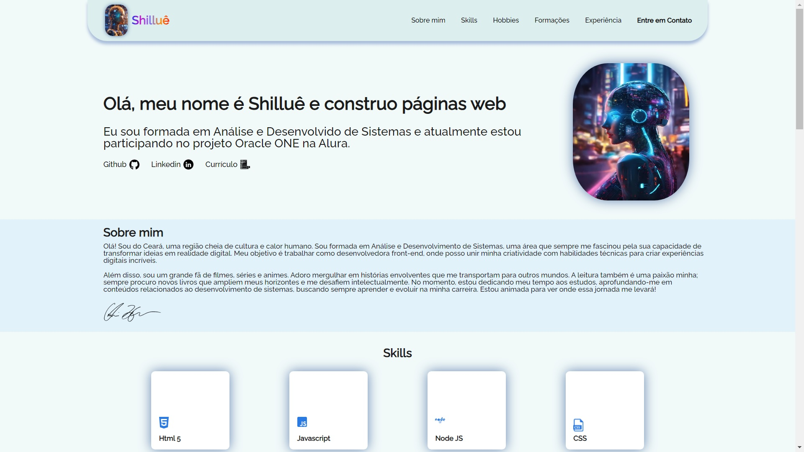

# challenge-one-portfolio
  Desafio do programa "ONE - Oracle Next Education" da Oracle em parceria com a Alura.

# Tecnologias Utilizadas

# Descrição
## Elementos principais da página
- Título do seu site;
- Menu Principal com links de redes sociais e do currículo em PDF;
- Seção Sobre Mim;
- Seção Hobbies e Soft Skills;
- Seção Formações + Cursos;
- Seção Experiência em programação;
- Formulário de Contato;
- Rodapé.

# Pré-visualização

### Links

- Solution URL: [Add solution URL here](https://github.com/Shillue/challenge-portfolio-shillue.git)
- Solution Site: [Add solution URL here](https://shillue.github.io/challenge-portfolio-shillue/)
